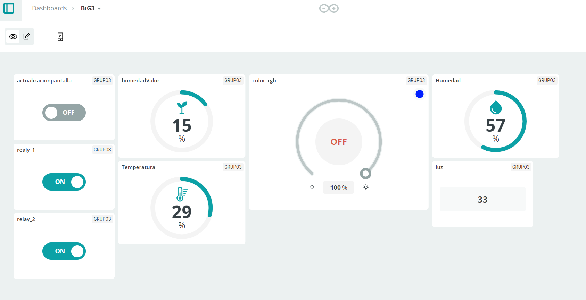

  
  <h1 align="center">Informe IV</h1>

 
<strong>Docentes:</strong>
- Mg. Umbert Lewis De La Cruz Rodriguez 
- Mg. Marcos Retamozo Ramos
- Mg. Moises Stevend Meza Rodriguez
- Mg. Carol Ordoñez Aquino
- Dr. Harry Anderson Rivera Tito  
- Dr. Pierre Ramos Apestegui 
- Ing. Renzo José Chan Ríos

<strong>Integrantes:</strong>
- Gavidia Crovetto, Bruno Paolo
- Silva Cuzqui, Camilo Sebastián
- Cueva Ramos, José Nilson
- Toribio Alvarado, Stephany Marilyn
- Herrera Valeriano, Jhunior Fernando 

  <h1 align="center">IoT</h1>

## Introducción
Este trabajo grupal consistió en convertir el **MKR IoT Carrier** en un dispositivo agrícola urbano. Se utilizaron sensores para monitorear el ambiente de una planta y relés para controlar dispositivos de alta potencia. El objetivo fue crear un entorno ideal y controlado para el crecimiento de la planta, utilizando **Arduino Cloud** para la visualización y control remoto de los datos.

## Objetivos de Aprendizaje
- Configuración de un entorno agrícola urbano.
- Entender cómo funcionan los relés y el sensor de humedad.
- Crear un ambiente adecuado para una planta.

## Componentes Utilizados
- **Arduino MKR WiFi 1010**: Controlador principal.
- **MKR IoT Carrier**: Sensores para monitorear el ambiente.
- **Sensor de humedad**: Mide la humedad del suelo.
- **Relés**: Activan dispositivos de alta potencia.
- **Cable Micro USB**: Para alimentación y programación.

## Creación del Panel de Control
Se creó un panel de control en **Arduino Cloud** con los siguientes widgets:

| Variable             | Widget         | Rango       |
|----------------------|----------------|-------------|
| humedad              | Porcentaje     | 0 - 100     |
| temperatura          | Indicador      | -40 - 100   |
| luz                  | Valor          | n/a         |
| humedadValor         | Porcentaje     | 0 - 100     |
| relé_1, relé_2       | Switch         | n/a         |
| rgbColor             | Luz coloreada  | n/a         |
| actualizaciónPantalla| Switch         | n/a         |

### Thing

Colocamos estos parámetros en un thing

El panel permite monitorear y controlar variables como la temperatura, humedad, luz, y activar dispositivos como luces mediante los relés.

## Monitorización y Control
El panel cuenta con cuatro widgets para monitoreo de sensores como humedad y temperatura, y cuatro widgets para control, permitiendo activar los relés y ajustar las luces. Esto permite mantener condiciones ideales para la planta (ejemplo: aloe vera), controlando el sistema de manera remota.

## Vdeo del funcionamiento del el DashBoard, Sensor de hUmedad en la tierra & humedad del Ambiente

https://github.com/user-attachments/assets/153e67ca-1442-43d6-9dee-e5ad4aee72ba

## Video del funcionamiento del las Luces RGB , sensor de luz y funcionamiento del los Relé

https://github.com/user-attachments/assets/fe6c3902-3731-4b86-9c52-435665b9c664

